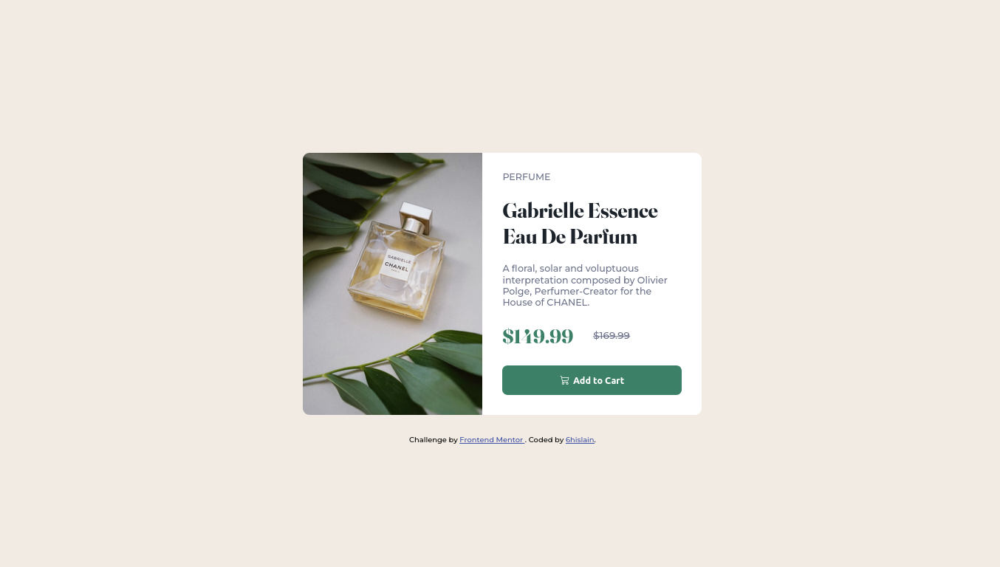

# Frontend Mentor - Product preview card component solution

This is a solution to the [Product preview card component challenge on Frontend Mentor](https://www.frontendmentor.io/challenges/product-preview-card-component-GO7UmttRfa). Frontend Mentor challenges help you improve your coding skills by building realistic projects. 

## Table of contents

- [Overview](#overview)
  - [The challenge](#the-challenge)
  - [Screenshot](#screenshot)
  - [Links](#links)
- [My process](#my-process)
  - [Built with](#built-with)
  - [What I learned](#what-i-learned)
  - [Continued development](#continued-development)
  - [Useful resources](#useful-resources)
- [Author](#author)
- [Acknowledgments](#acknowledgments)


## Overview

### The challenge

Users should be able to:

- View the optimal layout depending on their device's screen size
- See hover and focus states for interactive elements

### Screenshot



### Links

- Solution URL: [github.com/6hislain/product-preview-card-component](https://github.com/6hislain/product-preview-card-component)
- Live Site URL: [demo on netlify](https://62c8b3308a4a7a1232e54de8--astounding-tiramisu-40832e.netlify.app/)

## My process

### Built with

- Semantic HTML5 markup
- CSS custom properties
- Flexbox

### What I learned

Working on this coding challenge; I learnt about media queries in css

```css
/* css/style.css line 40 */

/* DESKTOP */
@media (min-width: 1440px) {
  .container {
    min-height: 100vh;
  }

  .card {
    max-width: 600px;
    flex-direction: row;
  }

  .card-img,
  .card-body {
    width: 50%;
  }

  .card-img {
    border-radius: 10px 0 0 10px;
    background-image: url("../images/image-product-desktop.jpg");
  }
}

/* MOBILE */
@media (min-width: 375px) and (max-width: 1440px) {
  .card {
    max-width: 320px;
    flex-direction: column;
  }

  .card-img {
    height: 200px;
    border-radius: 10px 10px 0 0;
    background-image: url("../images/image-product-mobile.jpg");
  }
}
```

I also learned about flexbox

```
/* css/style.css line 8 */
.container {
  max-width: 1440px;
  margin: auto;
  padding: 20px 0 20px 0;
  display: flex;
  flex-direction: column;
  align-items: center;
  justify-content: center;
  gap: 30px;
}

/* css/style.css line 113 */
.prices {
  margin: 25px 0 25px 0;
  display: flex;
  gap: 30px;
}
```

### Continued development

I am going to try completing more coding challenges on _Frontend Mentor_

### Useful resources

- [css tricks - flexbox guide](https://css-tricks.com/snippets/css/a-guide-to-flexbox/) - this article guided me on how to use flexbox
- [w3 school - css media queries](https://www.w3schools.com/css/css3_mediaqueries.asp) - this also helped me on media queries

## Author

- Bio Link - [bio.link/6hislain](https://www.bio.link/6hislain)
- Frontend Mentor - [@6hislain](https://www.frontendmentor.io/profile/6hislain)
- Twitter - [@6hislain](https://www.twitter.com/6hislain)

## Acknowledgments

Thanks to _Kevin Powell_ youtube videos, I started doing _Frontend Mentor_ challenges
